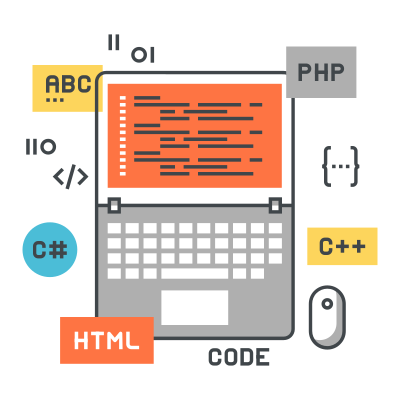

<h1 align="center">Data Structures and Algorithms</h1>

  
   
  
"I have no special talent. I am only passionately curious." -- Albert Einstein

 
 

<h1 align="center">Before Starting This Book</h1>

You’ll need to know **basic algebra**. In particular, take this function: $$f(x) = x \times 2$$. What is $$f(5)$$? If you answered 10, you’re set.

Additionally, this book will be easier to follow if you’re **familiar with one programming language**. All the examples in this book are in Java and Python. If you don’t know any programming languages and want to learn one, choose Python - It’s great for beginners. If you know another language, like JavaScript, you’ll be fine.
