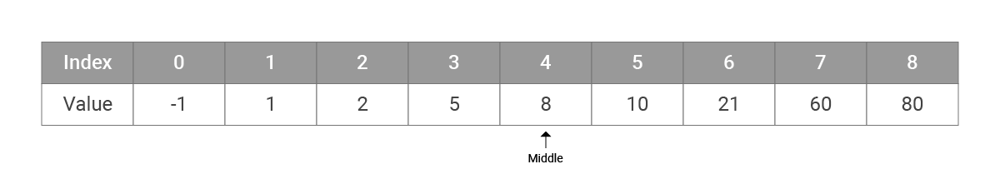
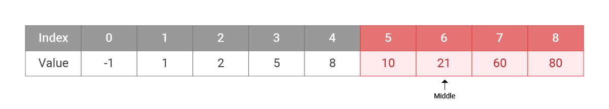
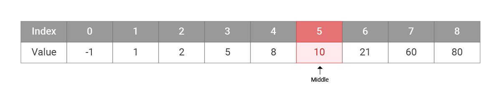

# Binary Search

Binary search is a searching algorithm which requires the input to be a **sorted array**.

**Step to perform binary search:**
1. Inspect the middle element (`mid`) of the sorted array
2. Check if `mid >= item`, where `item` is the element we are looking for
  * If `true`, left half of the array will be the new set to search
  * If `false`, right half of the array will be the new set to search
3. Repeat this process until either the element we are looking for is located or the array cannot be further divided

## Example

Given an array `[-1, 1, 2, 5, 8, 10, 21, 60, 80]` and an item `10`, find the index of the item. If it is not found, return `-1`.
1. Inspect the middle element
  * Middle element:  index = 4(`(0 + 8) / 2`), which contains value `8`
  * `8 >= 10` returns `false`, continue the search on right half of the array (`[10, 21, 60, 80]`)
  * 
2. Inspect the middle element of in the right half of the array 
  * New middle element: index = 6 (`(5 + 8) / 2`), which contains value `21`
  * `21 >= 10` returns `true` , continue the search on left half of the new set (`[10]`)
  * 
3.  Inspect the middle element, which is also the last element to search
  * New middle element: index = 5 (`(5 + 5) / 2`), which contains value `10`
  * `10 == 10` returns `true`
  * return the index of element `5`
  * 

## Code Sample

Python:
```Python
def binary_search(list, item): 
  low = 0
  high = len(list)-1

  while low <= high: 
    mid = (low + high) // 2  # '//' for floor division 
    guess = list[mid] 
    
    if guess == item:
      return mid
    if guess > item: 
      high = mid - 1
    else:
      low = mid + 1
  
  return -1

my_list = [-1, 1, 2, 5, 8, 10, 21, 60, 80]
binary_search(my_list, 10) # result: 5
```

## Complexity Analysis

* Time complexity : $${O}(\log_2n)$$
