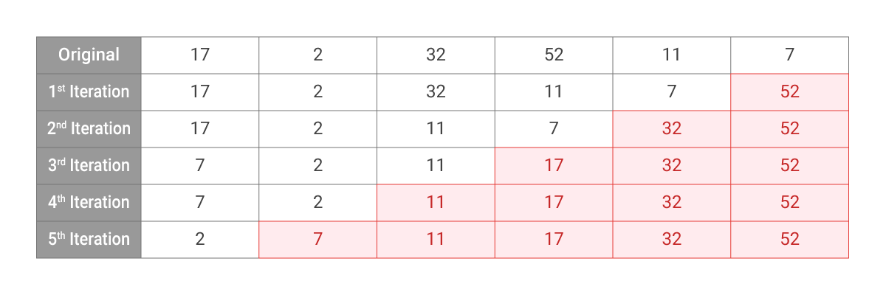

# Selection Sort

**Step to perform selection sort:**
1. Select the largest element in the array
2. Move that element to the last position
3. Repeat but ignoring the last element

## Example

Given an array `[17, 2, 32, 52, 11, 7]`, sort it using selection sort.

Example:  



## Code Sample


```Python
def findSmallest(arr): 
  smallest = arr[0] 
  smallest_index = 0
  for i in range(1, len(arr)):
    if arr[i] < smallest: 
      smallest = arr[i] 
      smallest_index = i
  return smallest_index

def selectionSort(arr): 
  newArr = []
  for i in range(len(arr)):
    smallest = findSmallest(arr)
    newArr.append(arr.pop(smallest)) 
  return newArr

result = selectionSort([17, 2, 32, 52, 11, 7])
print(result)
```
```cpp::C++
#include <iostream>
using namespace std;

void selectionSort(int A[], int len) {
  for(int i = 0; i < len; i++) {
    int maxPos = 0;
      for(int j = 1; j < len - i; j++) {
        if(A[j] > A[maxPos])
          maxPos = j;
    }

    int temp = A[maxPos];
    A[maxPos] = A[len - 1 - i];
    A[len - 1 - i] = temp;
  }
}

void printArray(int arr[], int size) {  
  int i;  
  for (i = 0; i < size; i++) {
    cout << arr[i] << " ";  
  }
  cout << endl;  
}

int main() {
  int arr[] = {17, 2, 32, 52, 11, 7};
  int n = sizeof(arr)/sizeof(arr[0]);
  selectionSort(arr, n);

  cout << "Sorted array: \n";  
  printArray(arr, n); 
}
```


## Complexity Analysis

* Time complexity : $${O}(n^2)$$
