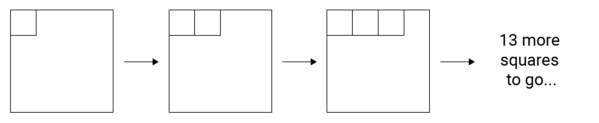
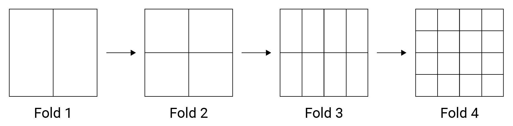

# Introduction to Asymptotic Notation

##Why do we need to analyse algorithms?
Writing a working program is not sufficient. The program may not be efficient. If the program is run on a large set of data, then the running time of a program becomes a problem.

#### Example
An example taken from [Grokking Algorithms](https://amzn.to/376TGy9) will help to explain. Imagine you are given a piece of square paper, and your task is to divide it into 16 pieces. How would you do?

** Approach 1: Draw sixteen individual squares **  
Steps required to draw 16 squares are **16**.

** Approach 2: Fold the paper in half until it reaches 16 squares **  
We only need to fold the paper 4 times to get 16 squares. Steps required is **4**.

 
What if number of required squares changed? What's the difference between these two approach?

| Required squares | Approach 1 | Approach 2 |
|------------------|------------|------------|
| 16               | 16         | 4          |
| 64               | 64         | 6          |
| 256              | 256        | 8          |
| 1024             | 1024       | 10         |

When the number of required squares ($$n$$) continues to grow, difference between the 2 approach becomes larger.
While steps required for approach 1 will always be $$n$$, it only need $$\log_2 n$$ steps for approach 2.

## Measuring performance of algorithms
The running time of an algorithm depends on how long it takes a computer to run the lines of code of the algorithm (and that depends on the speed of the computer), the programming language, and the compiler that translates the program from the programming language into code that runs directly on the computer, among other factors.

To analyse an algorithm in a machine and language independent way, **number of operations (time complexity)** and **memory usage (Space complexity)** is measured. Asymptotic notation is a common language used to represent **complexity**.

Three forms of asymptotic notation are:
* [Big-O ($$O$$)](./big-o-notation.md)
* Big-Omega ($$\Omega$$)
* Big-Theta ($$\Theta$$)
