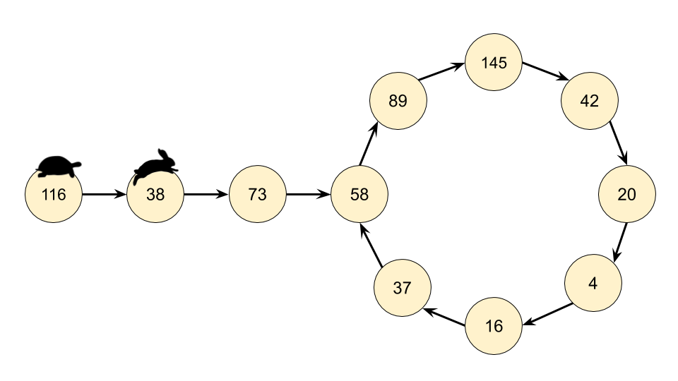
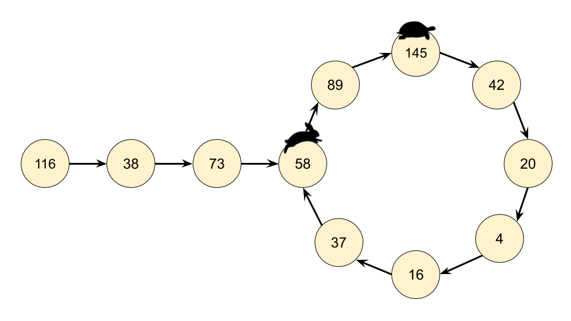

# 202. Happy Number
[&larr;&nbsp;Back to problem](./README.md)

## Approach 2: Floyd's Cycle-Finding Algorithm

### Intuition

The chain we get by repeatedly calling `getNext(n)` is an implicit **LinkedList**. *Implicit* means we don't have actual LinkedNode's and pointers, but the data does still form a LinkedList structure. The starting number is the head "node" of the list, and all the other numbers in the chain are nodes. The next pointer is obtained with our `getNext(n)` function above.

Recognizing that we actually have a LinkedList, we can use [Floyd's Cycle-Finding Algorithm](https://en.wikipedia.org/wiki/Cycle_detection#Floyd.27s_Tortoise_and_Hare) here. This algorithm is based on 2 runners running around a circular race track, a fast runner and a slow runner. In reference to a famous fable, many people call the slow runner the "tortoise" and the fast runner the "hare".

Regardless of where the tortoise and hare start in the cycle, they are guaranteed to eventually meet. This is because the hare moves one node closer to the tortoise (in their direction of movement) each step.







### Algorithm
Instead of keeping track of just one value in the chain, we keep track of 2, called the slow runner and the fast runner. At each step of the algorithm, the slow runner goes forward by 1 number in the chain, and the fast runner goes forward by 2 numbers (nested calls to the `getNext(n)` function).

If `n` is a happy number, i.e. there is no cycle, then the fast runner will eventually get to 1 before the slow runner.

If `n` is not a happy number, then eventually the fast runner and the slow runner will be on the same number.

### Implementation

Java: 
```Java
class Solution {
     public int getNext(int n) {
        int totalSum = 0;
        while (n > 0) {
            int d = n % 10;
            n = n / 10;
            totalSum += d * d;
        }
        return totalSum;
    }

    public boolean isHappy(int n) {
        int slowRunner = n;
        int fastRunner = getNext(n);
        while (fastRunner != 1 && slowRunner != fastRunner) {
            slowRunner = getNext(slowRunner);
            fastRunner = getNext(getNext(fastRunner));
        }
        return fastRunner == 1;
    }
}
```

Python:
```Python
def isHappy(self, n: int) -> bool:  
    def get_next(number):
        total_sum = 0
        while number > 0:
            number, digit = divmod(number, 10)
            total_sum += digit ** 2
        return total_sum

    slow_runner = n
    fast_runner = get_next(n)
    while fast_runner != 1 and slow_runner != fast_runner:
        slow_runner = get_next(slow_runner)
        fast_runner = get_next(get_next(fast_runner))
    return fast_runner == 1
```

### Complexity Analysis

* Time complexity: $${O}(\log n)$$. Builds on the analysis for the previous approach, except this time we need to analyse how much extra work is done by keeping track of two places instead of one, and how many times they'll need to go around the cycle before meeting.
  * If there is no cycle, then the fast runner will get to 1, and the slow runner will get halfway to 1. Because there were 2 runners instead of 1, we know that at worst, the cost was $$O(2 \cdot \log n) = O(\log n)$$.
  * Once both pointers are in the cycle, the fast runner will get one step closer to the slow runner at each cycle. Once the fast runner is one step behind the slow runner, they'll meet on the next step. Imagine there are $$k$$ numbers in the cycle. If they started at $$k - 1$$ places apart (which is the furthest apart they can start), then it will take $$ k-1 $$ steps for the fast runner to reach the slow runner, which again is constant for our purposes. Therefore, the dominating operation is still calculating the next value for the starting $$n$$, which is $$O(\log n)$$.

* Space complexity: $${O}(1)$$, space required for `fast` and `slow` pointers are always the same.
