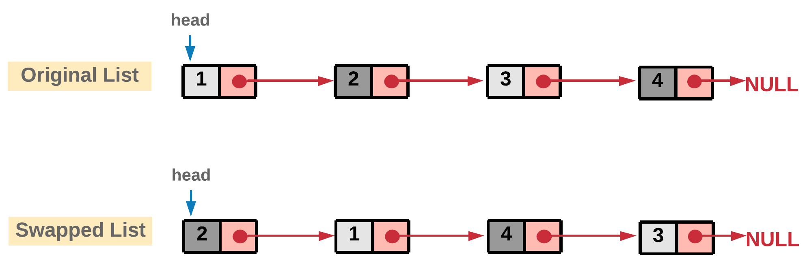
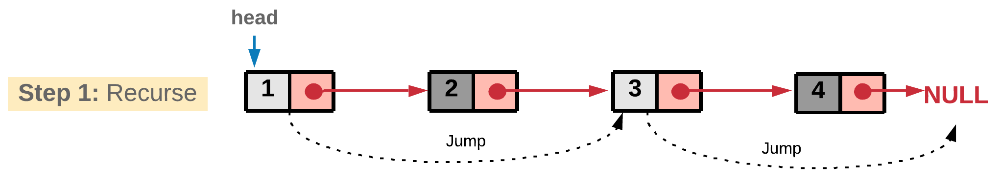
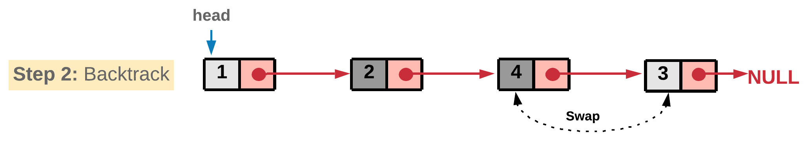
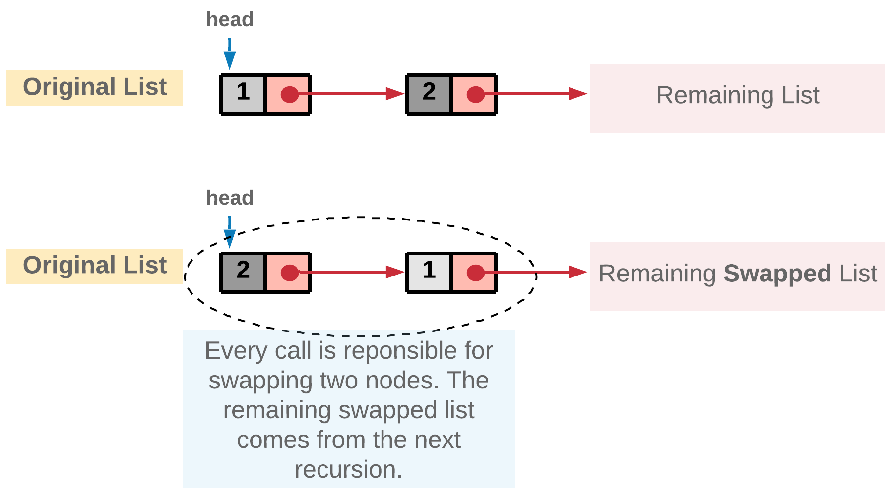
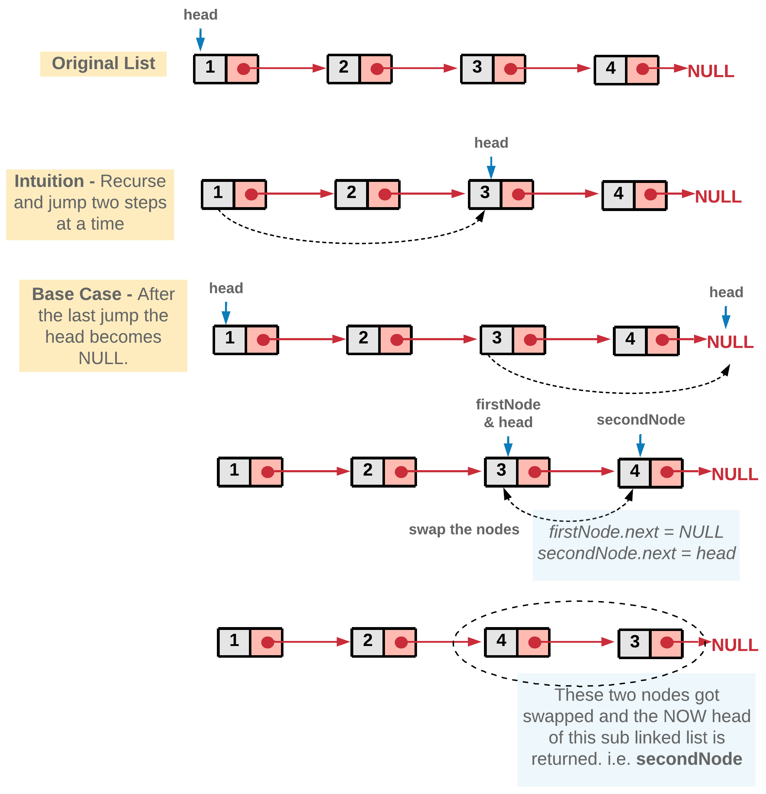

# 24. Swap Nodes in Pairs
[&larr;&nbsp;Back to problem](./README.md)

## Approach 1: Recursive Approach

###Intuition

The problem doesn't ask for entire reversal of linked list. It's rather asking us to swap every two adjacent nodes of a linked list starting at the very first node.



The basic intuition is to reach to the end of the linked list in steps of two using recursion.



and while back tracking the nodes can be swapped.



In every function call we take out two nodes which would be swapped and the remaining nodes are passed to the next recursive call. The reason we are adopting a recursive approach here is because a sub-list of the original list would still be a linked list and hence, it would adapt to our recursive strategy. Assuming the recursion would return the swapped `remaining` list of nodes, we just swap the current two nodes and attach the remaining list we get from recursion to these two swapped pairs.



### Algorithm

1. Start the recursion with `head` node of the original linked list.
2. Every recursion call is responsible for swapping a pair of nodes. Let's represent the two nodes to be swapped by `firstNode` and `secondNode`.
3. Next recursion is made by calling the function with head of the next pair of nodes. This call would swap the next two nodes and make further recursive calls if there are nodes left in the linked list.
4. Once we get the pointer to the remaining swapped list from the recursion call, we can swap the `firstNode` and `secondNode` i.e. the nodes in the current recursive call and then return the pointer to the `secondNode` since it will be the new head after swapping.  
  
5. Once all the pairs are swapped in the backtracking step, we would eventually be returning the pointer to the head of the now `swapped` list. This head will essentially be the second node in the original linked list.

### Implementation

Java: 
```Java
/**
 * Definition for singly-linked list.
 * public class ListNode {
 *     int val;
 *     ListNode next;
 *     ListNode(int x) { val = x; }
 * }
 */
class Solution {
    public ListNode swapPairs(ListNode head) {

        // If the list has no node or has only one node left.
        if ((head == null) || (head.next == null)) {
            return head;
        }

        // Nodes to be swapped
        ListNode firstNode = head;
        ListNode secondNode = head.next;

        // Swapping
        firstNode.next  = swapPairs(secondNode.next);
        secondNode.next = firstNode;

        // Now the head is the second node
        return secondNode;
    }
}
```

Python:
```Python
# Definition for singly-linked list.
# class ListNode(object):
#     def __init__(self, x):
#         self.val = x
#         self.next = None


class Solution(object):
    def swapPairs(self, head: ListNode) -> ListNode:
        """
        :type head: ListNode
        :rtype: ListNode
        """

        # If the list has no node or has only one node left.
        if not head or not head.next:
            return head

        # Nodes to be swapped
        first_node = head
        second_node = head.next

        # Swapping
        first_node.next  = self.swapPairs(second_node.next)
        second_node.next = first_node

        # Now the head is the second node
        return second_node
```

### Complexity Analysis
* Time Complexity: $$O(n)$$, where $$n$$ is the size of the linked list.
* Space Complexity: $$O(n)$$ stack space utilized for recursion.
