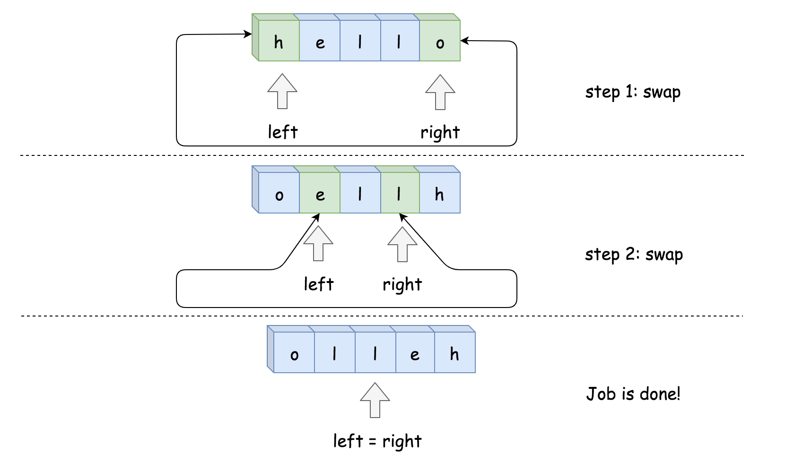

# 344. Reverse String
[&larr;&nbsp;Back to problem](./README.md)

## Approach 2: Two Pointers, Iteration, $${O}(1)$$ Space

### Two Pointers Approach

In this approach, two pointers are used to process two array elements at the same time. Usual implementation is to set one pointer in the beginning and one at the end and then to move them until they both meet.

Sometimes one needs to generalize this approach in order to use three pointers, like for classical [Sort Colors problem](https://leetcode.com/articles/sort-colors/).

### Algorithm

* Set pointer left at index 0, and pointer right at index `n - 1`, where n is a number of elements in the array.
* While left < right:
  * Swap `s[left]` and `s[right]`.
  * Move left pointer one step right, and right pointer one step left.



### Implementation


```Java
class Solution {
    public void reverseString(char[] s) {
        int left = 0, right = s.length - 1;
        while (left < right) {
            char tmp = s[left];
            s[left++] = s[right];
            s[right--] = tmp;
        }
    }
}
```
```Python
class Solution:
    def reverseString(self, s):
        left, right = 0, len(s) - 1
        while left < right:
            s[left], s[right] = s[right], s[left]
            left, right = left + 1, right - 1
```


### Complexity Analysis

* Time complexity : $${O}(n)$$ to swap $$n/2$$ element.
* Space complexity : $${O}(1)$$, it's a constant space solution.
